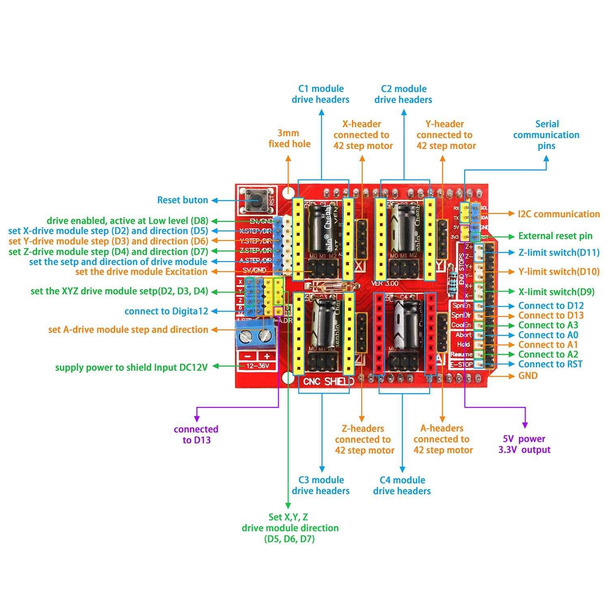
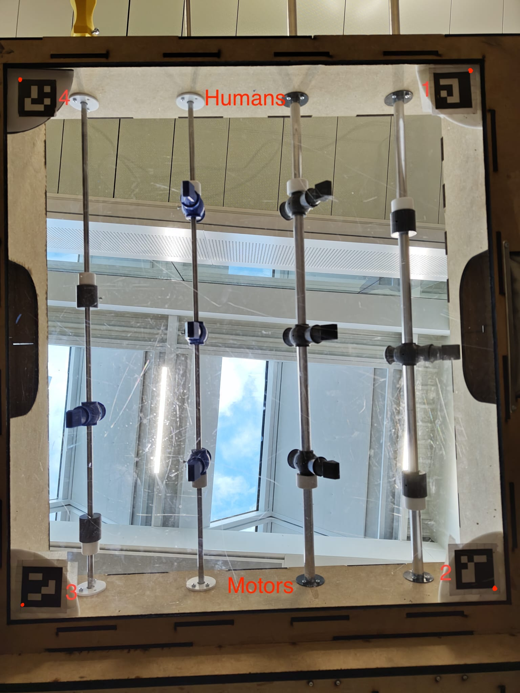
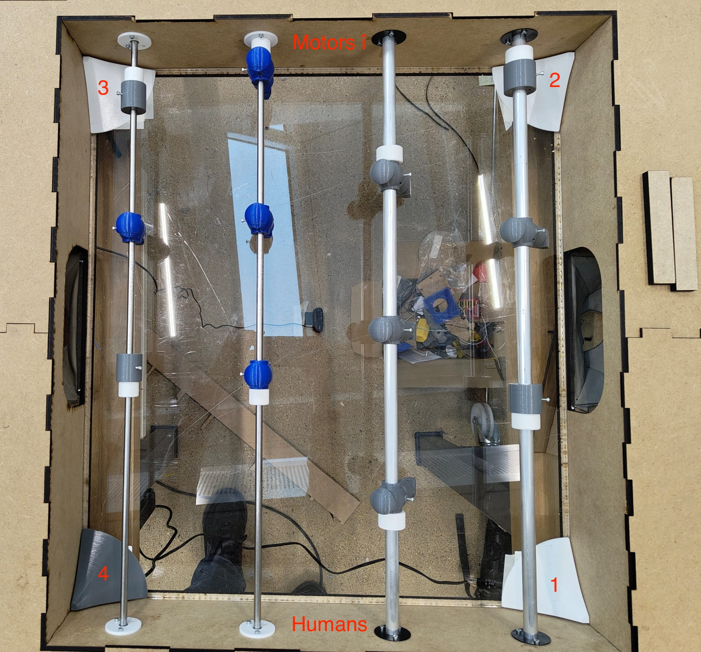
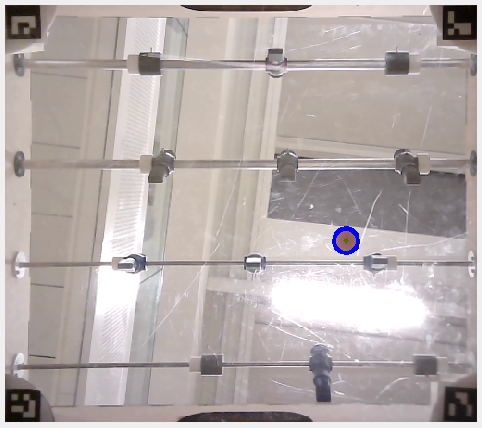

# Foosbot
<a name="readme-top"></a>

### Authors
- [Arthur Taieb](https://github.com/ArthurTota)
- [Ella Neike](https://github.com/Ella1807)
- [Tizian Kurz](https://github.com/TizianKurz)
- [Robin Nicole](https://github.com/Crowerade)
- [Nur Ertug](https://github.com/NurErtugn)

<details>
  <summary>Table of Contents</summary>
  <ol>
    <li>
      <a href="#project-overview">Project Overview</a>
      <ul>
        <li><a href="#built-with">Built With</a></li>
        <li><a href="#motivation">Motivation</a></li>
        <li><a href="#project-structure">Project Structure</a></li>
        <li><a href="#final-result">Final Result</a></li>
      </ul>
    </li>
    <li>
      <a href="#before-starting">Before Starting</a>
      <ul>
        <li><a href="#list-of-materials">List Of Materials</a></li>
        <li><a href="#requirements">Requirements</a></li>
      </ul>
    </li>
    <li>
      <a href="#doing-it-yourself">Doing It Yourself</a>
      <ul>
        <li><a href="#general-overview-of-tasks">General Overview Of Tasks</a></li>
        <li><a href="#lasercutting">LaserCutting</a></li>
        <li><a href="#3d-printing">3D Printing</a></li>
        <li><a href="#assembling-the-table">Assembling The Table</a></li>
      </ul>
    </li>
    <li>
      <a href="#wiring-of-the-motors">Wiring Of The Motors</a>
      <ul>
        <li><a href="#electronics-chart">Electronics Chart</a></li>
        <li><a href="#motor-and-endstop-sensor-labelling">Motor And EndStop Sensor Labelling</a></li>
        <li><a href="#protecting-motors-and-laptop">Protecting Motors And Laptop</a></li>
      </ul>
    </li>
    <li>
      <a href="#uploading-arduino-code">Uploading Arduino Code</a>
      <ul>
        <li><a href="#dependencies">Dependencies</a></li>
        <li><a href="#uploading-code">Uploading Code</a></li>
        <li><a href="#troubleshooting-arduino">Troubleshooting Arduino</a></li>
      </ul>
    </li>
    <li>
      <a href="#camera-vision">Camera Vision</a>
      <ul>
        <li><a href="#qr-code-markers">QR Code Markers</a></li>
        <li><a href="#code">Code</a></li>
        <li><a href="#installing-dependencies">Installing dependencies </a></li>
        <li><a href="#starting-camera-vision">Starting Camera Vision</a></li>
        <li><a href="#output">Output</a></li>
        <li><a href="#troubleshooting-camera-vision">Troubleshooting Camera Vision</a></li>
      </ul>
    </li>
  </ol>
</details>

## Project Overview

### Built With
* [![Python][Python.org]][Python-url]
* [![Cpp][Cpp.org]][Cpp-url]

### Motivation 
Table football, commonly known as foosball or table soccer, is a fast-paced game inspired by association football. Players aim to score goals by maneuvering rods with miniature figures representing football players from two opposing teams. While typically enjoyed by 2-4 players, traditional foosball is not designed for solo play.

This project seeks to develop a foosball table playable by a single player using an Arduino Uno microcontroller. The system will allow one side of the game to be automated and controlled via a computer program, while a human player operates the other side. The automated system will manage two axes of movement for each rod: rotation and linear displacement.

However, to simplify development and reduce costs, the prototype will use a smaller-scale foosball table with two rods per side instead of the standard four. This scaled-down design reduces system complexity and enhances motor responsiveness, making it more suitable for our project goals.

### Project Structure
- `Admin` : Contains images used in the README
- `CAD` : Contains all the CAD stl files as well as the dxf files for lasercutting
- `Hardware` : Contains the electronic circuit diagram and a document with hardware component specifications
- `Software` : Contains all the code
  - `Software/Algorithms/followBall` : Contains the Arduino code for controlling the motors and handling the game logic
  - `Software/Camera/cv/python-webcam` : Contains the python code for the computer vision as well as the QR Markers to printout

### Final Result 

https://github.com/user-attachments/assets/dd09006e-b9f9-418b-b552-d5e2579a633e


<p align="right">(<a href="#readme-top">back to top</a>)</p>

## Before Starting

### List of Materials 
You will need to buy:
- [x] 4 17HS4401 Stepper Motors
- [x] 4 A4988 Motor Drivers
- [x] 4 End stop Sensors
- [x] 1 Arduino Uno
- [x] 1 USB cable to connect to the Arduino
- [x] 1 CNC Shield
- [x] 1 USB Isolator
- [x] 1 Logitech Webcam C270
- [x] 2 Aluminium Profile _20_ _x_ _20mm_ of length _410mm_
- [x] 1 12V Power Supply
- [x] 1 Power Supply Plug
- [x] 2 _~1_ _meter_ GT2 _6mm_ belt
- [x] 1 _1_ _meter_ WS2813 LED Strips
- [x] 1 Bread board
- [x] 2 Metal Bars with diameter _15_ _mm_ length _1200_mm
- [x] 2 Metal Bars with diameter _8_ _mm_ length _1200_mm
- [x] 4 Ball Bearings that allow for both rotational and linear motion
- [x] 8 Wheels (Something like [this](https://www.zyltech.com/zyltech-20-series-wheel-pulley-bearing-for-2020-aluminum-extrusion-v-slot-compatible/))
- [x] 2 Pully
- [x] Jumper cables
- [x] 1 ball

To assemble you also need the following

Pole Components:
- [x] 48 _M3_ screws with nuts, length _8mm_
- [x] 12 _M2.5_ screws with nuts, length _12mm_
- [x] 2 _M4_ screws with nuts, length _16mm_

Mechanical Components:
- [x] 14 _M3_ screws with nuts, length _8mm_
- [x] 2 _M3_ screws with nuts, length _25_mm
- [x] 16 x _M2.5_ screws with nuts, length _8mm_
- [x] 2 x steel bars, diameter _4mm_, length _3.2mm_
- [x] 2 x steel bars, diameter _4mm_, length _2.2mm_

### Requirements 
have access to:
  -	3D printer with TPU filament
  -	3D printer with PET filament
  -	Laser cutting machine
  -	PlexiGlass _10mm_
  -	MDF board _3mm_
  -	MDF board _4mm_
  -	MDF board _5mm_
  -	MDF board _10mm_
  -	Driller
  -	Bunch of different screwdrivers
  -	Soldering kit

<p align="right">(<a href="#readme-top">back to top</a>)</p>

## Doing it yourself

### General Overview of tasks
- Lasercut
- 3D Print
- Assemble the Table
- Wire up the motors to the Arduino
- Set up the Camera Vision

### LaserCutting
Lasercut with the right MDF thickness (is in the file names): [DXF files](CAD/laser_Cuted_Components) 

### 3D Printing
3D Print the following pieces from the CAD:

For 3D printing of Pole Components: [STL files](CAD/PoleComponents) 

- 4 x Players with _15mm_ radius (Computer Controlled) -> Perimeter 6
- 4 x Players with _8mm_ radius (Human Controlled)     -> Perimeter 6
- 2 x GardianStop _15mm_ radius                        -> Perimeter 2
- 2 x GardianStop _8mm_ radius                         -> Perimeter 2
- 4 x Bumpers with _15mm_ radius                       -> Perimeter 2
- 4 x Bumpers with _8mm_ radius                        -> Perimeter 2
- 8 x Bushing with _15mm_ radius                       -> Perimeter 3
- 8 x Bushing with _8mm_ radius                        -> Perimeter 3
- 2 x Handles                                          -> Perimeter 5
- 2 x End Caps _8mm_ radius                            -> Perimeter 3
- 2 x End Caps _15mm_ radius                           -> Perimeter 3

For 3D printing of Mechanical Components: [STL files](CAD/MechanicalComponents)
  
- 2 x Standing Motor holder                            -> Perimeter 2
- 2 x Rotation Motor holder                            -> Perimeter 2
- 2 x Motor to Pole Connector                          -> Perimeter 5
- 2 x Railing holder without pulley                    -> Perimeter 2
- 2 x Railing holder with pulley                       -> Perimeter 2
- 2 x pulley                                           -> Perimeter 2
- 2 x wheels (to put at the end of the belts)          -> Perimeter 2
- 4 x Belt to motor Platform Connector                 -> Perimeter 5

Our 3D printing steps: 
Use Fusion 360 to create and edit the pieces 

Open Prusaslicer to prepare pieces for impression: 
1. Select Filament PETG
2. Select Printer MK4 with 0.4 nozzle or i3 MK3S & MK3S+
3. Select Print Setting 0.20mm QUALITY
4. Place and add necessary supports to print out pieces correctly
5. Edit the perimeter of the pieces for more resistance if needed
6. Slice and Print

For the Bumpers:
Open Prusaslicer to prepare pieces for impression: 
1. Select Filament NinjaTek NinjaFlex TPU
2. Select Printer i3 MK3S & MK3S+
3. Select Print Setting 0.20mm QUALITY
4. ! don't use supports
5. Place pieces and Slice 
6. Add glue to printing bed
7. Print 

When slicing be careful of the surface on which you print your pieces, to ideally minimize supports needed or place them in a smart way. 

### Assembling The Table 
1. Glue all the mdf pieces together with wood glue
2. Add ball bearings and screw bushings
3. Insert poles in one bushing and add the bumpers, add players with a spacing of _184mm_ between player/gardianStop, add gardianStop
4. Insert poles into second bushing and add endcaps and handles
5. Follow picture in Final Result to finish assembly


<p align="right">(<a href="#final_result_top">back to Final Result</a>)</p>

For ball reception place the following way


<p align="right">(<a href="#readme-top">back to top</a>)</p>

## Wiring of the Motors

### Electronics Chart


CNC shield mounted on top of the Arduino Uno , reset buttons should be aligned 
CNC shield-Arduino Uno pin correspondance


When installing the A4988 Motor Drivers set the voltage in alternate current to 1.2V
by turning the screws and using a multimeter. 

### Motor And EndStop Sensor Labelling
On the CNC Shield there are 3 slots for motor drivers labelled X, Y, Z, A. In the picture below you see to which motor they should be connected to.

The End stop sensors have three cables that need to be connected, one to the ground, one to the 5V Power and one to the correct pins on the CNC Shield. The mapping of the position of the end stop sensors to the pins on the CNC Shield are shown in green in the picture below.


### Protecting Motors and Laptop
Always connect the Arduino via a USB-Isolator to your laptop and ideally don't charge your laptop while it is connected to the Arduino.
It is also important that you unplug the power and the Arduino before changing anything on the wiring or manually moving the motors.
Generally it is also advised to disconnect the power and the arduino whenever you're not using them.
Also note that the motor drivers on the CNC shield might head up a bit if used for a long period of time.

<p align="right">(<a href="#readme-top">back to top</a>)</p>

## Uploading Arduino Code

### Dependencies
You need to have [Arduino IDE](https://www.arduino.cc/en/software) installed, as well as the libraries

### Uploading Code
1. Open the code for the Arduino in `/Software/Algorithms/beginner/beginner.ino`
2. Connect the Arduino via the USB Isolator to your laptop
3. Press the upload button in the top left of the Arduino IDE

### Troubleshooting Arduino

- If you get a compilation error, check whether you have all libraries installed.
- If you get an error while uploading, check whether you have selected the right board and port and try again.
- If the motors don't move check your wiring. If that doesn't help check the voltage of the motor drivers using a multimeter. Also the [documentation](https://docs.cirkitdesigner.com/component/2c4686b3-94a4-4df1-aee0-7a9f67fd5f2e/cnc-shield-v3) of the CNC shield might help.

<p align="right">(<a href="#readme-top">back to top</a>)</p>

## Camera Vision

### QR Code Markers
You need to print out the 4 QR Code Markers stored in the file
[`/Software/Camera/cv/python-webcam/ArUco markers.pdf`](https://github.com/epfl-cs358/2024fa-foosbot/blob/main/Software/Camera/cv/python-webcam/ArUco%20markers.pdf)
and cut them out. 

You then have to tape the QR Codes into the Right corners. Note that the top left corner, marked red in images below, should always point towards the corner. The QR Codes are numbered (see below) and they need to be in the right corners, according to the image below.







__It is important that the Codes are at in the right corners and oriented the right way!__
Otherwise the camera vision will not detect the playing field correctly and do a weird transformation or cut of some part.

### Code
The code for the Camera Vision is located in the folder
[`/Software/Camera/cv/python-webcam/main.py`](https://github.com/epfl-cs358/2024fa-foosbot/blob/main/Software/Camera/cv/python-webcam/main.py)

### Installing Dependencies
You need to have python installed on your computer (See [here](https://realpython.com/installing-python/) an article how to install python).
You als need the following libraries:
- [PySerial](https://pypi.org/project/pyserial/)
- [opencv](https://opencv.org/)

If you are on linux or macOS and have pip installed you can simply run 

```commandline
pip install pyserial
pip install opencv
```
If you're having trouble, check with your package manager whether it accepts pip installs.

### Starting Camera Vision
Note that you have to close all Serial monitors in the ArduinoIDE since it prevents the computer vision from opening the port. You can open it again when the computer vision is running.
2. Plug in the Logitech webcam,
1. Plug in the Arduino UNO,
3. Navigate to folder ` Software/Camera/cv/python-webcam `,
4. Run ` ./main.py `.

If you want to know how to use different flags, type `./main.py --help`.

### Output




By default the camera should open a window called Output which displays the area in which the ball can be detected. If  the ball is detected, there should be a blue circle around it.

### Troubleshooting Camera Vision
- If the camera is not activating properly, try changing the parameter of the call to the ` cv2.VideoCapture ` function to another number (usually 0 or 2). You can also use the `-i` flag for that.
- If the camera vision does a weird transformation then the QR Codes are not placed in the right corners.
- If the output doesn't show the entire field, then the QR Codes might not be oriented correctly (Top left corner ins't pointing towards the corner).
- If the ball isn't detected then you might need to change the allowed range for the radius (line 37 in [`main.py`](https://github.com/epfl-cs358/2024fa-foosbot/blob/main/Software/Camera/cv/python-webcam/main.py)). By default it is set to accept radius between 25 and 31. This works well for us on Macbooks but we observed that on Linux a range of 10 to 15 is appropriate.
- If the code has a problem uploading to the arduino try doing the following (sometimes the port has a problem):
1. Stop the computer vision
2. Make sure you have no serial monitor open on the arduino ide and close all other sketches
3. Plug in the arduino uno again and upload the code
4. Start the computer vision again 

Remember that you can use different flags to debug the computer vision. For example you can display views of different stages of computer vision (Marker detection, image transformation, etc.) using the --w or --windows flag or you can disable the Serial output if no Arduino is connected by  using the -n or --no-ser-out flag.

<p align="right">(<a href="#readme-top">back to top</a>)</p>

[Python.org]: https://img.shields.io/badge/Python-brightgreeen?style=flat&logo=python&logoColor=FFE873&color=306998
[Python-url]: https://www.python.org/
[Cpp.org]: https://img.shields.io/badge/C%2B%2B-blue?logo=cplusplus
[Cpp-url]: https://isocpp.org/
